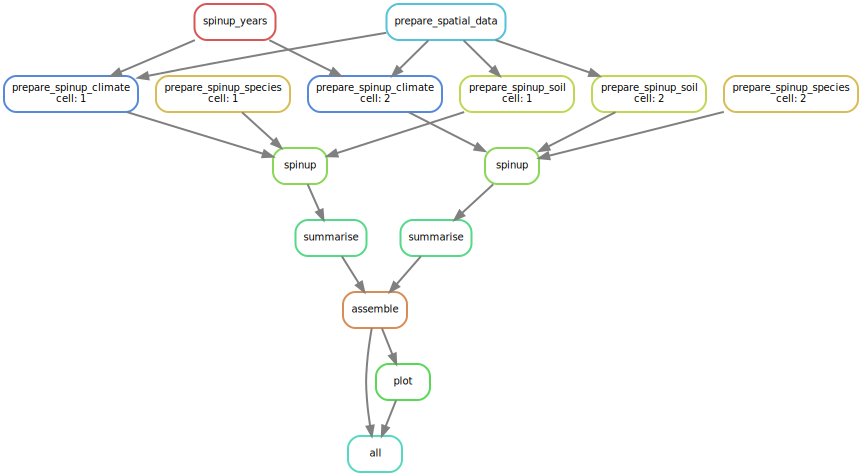

```{r setup, include=FALSE}
rm(list = ls()) ; invisible(gc()) ; set.seed(42)
library(knitr)
library(tidyverse)
theme_set(bayesplot::theme_default())
opts_chunk$set(echo = F, message = F, warning = F, fig.height = 6, fig.width = 8,
               cache = F, cache.lazy = F)
```

[`singularity` & `snakemake`](https://github.com/sylvainschmitt/snakemake_singularity) workflow to run a TROLL experiment with climate.

```{r dag, fig.cap="Workflow."}

```

# Installation

- [x] Python ≥3.5
- [x] Snakemake ≥5.24.1
- [x] Golang ≥1.15.2
- [x] Singularity ≥3.7.3
- [x] This workflow

```{bash, eval=F, echo=T}
# Python
sudo apt-get install python3.5
# Snakemake
sudo apt install snakemake`
# Golang
export VERSION=1.15.8 OS=linux ARCH=amd64  # change this as you need
wget -O /tmp/go${VERSION}.${OS}-${ARCH}.tar.gz https://dl.google.com/go/go${VERSION}.${OS}-${ARCH}.tar.gz && \
sudo tar -C /usr/local -xzf /tmp/go${VERSION}.${OS}-${ARCH}.tar.gz
echo 'export GOPATH=${HOME}/go' >> ~/.bashrc && \
echo 'export PATH=/usr/local/go/bin:${PATH}:${GOPATH}/bin' >> ~/.bashrc && \
source ~/.bashrc
# Singularity
mkdir -p ${GOPATH}/src/github.com/sylabs && \
  cd ${GOPATH}/src/github.com/sylabs && \
  git clone https://github.com/sylabs/singularity.git && \
  cd singularity
git checkout v3.7.3
cd ${GOPATH}/src/github.com/sylabs/singularity && \
  ./mconfig && \
  cd ./builddir && \
  make && \
  sudo make install
# detect Mutations
git clone git@github.com:sylvainschmitt/trollExp.git
cd trollExp
git checkout climate
```

# Usage

## Locally

```{bash, eval=F, echo=T}
snakemake -np -j 1 # dry run
snakemake --dag | dot -Tsvg > dag/dag.svg # dag
data="/home/sschmitt/Documents/trollExp/data"
snakemake -j 20 --use-singularity --singularity-args "\-e \-B $data" # run
```

## HPC

### Muse

```{bash, eval=F, echo=T}
module load snakemake # for test on node
snakemake -np # dry run
sbatch job_muse.sh # run
```

### Genologin

```{bash, eval=F, echo=T}
module load bioinfo/snakemake-5.25.0 # for test on node
snakemake -np # dry run
sbatch job_genologin.sh # run
```


# Workflow

## Climate

### [prepare_guyaflux](https://github.com/sylvainschmitt/trollExp/blob/climate/rules/prepare_guyaflux.smk)

* Script: [`prepare_guyaflux.R`](https://github.com/sylvainschmitt/trollExp/blob/climate/scripts/prepare_guyaflux.R)

Prepare guyaflux data at a half-hourly time step.

### [prepare_era](https://github.com/sylvainschmitt/trollExp/blob/climate/rules/prepare_era.smk)

* Script: [`prepare_era.R`](https://github.com/sylvainschmitt/trollExp/blob/climate/scripts/prepare_era.R)

Prepare ERA5-Land data at a half-hourly time step.

### [prepare_cordex](https://github.com/sylvainschmitt/trollExp/blob/climate/rules/prepare_cordex.smk)

* Script: [`prepare_cordex.R`](https://github.com/sylvainschmitt/trollExp/blob/climate/scripts/prepare_cordex.R)

Prepare South-America (SAM) CORDEX data for a given model and regional climate model (RCM) at a half-hourly time step.

## TROLL inputs

### [select_years](https://github.com/sylvainschmitt/trollExp/blob/climate/rules/select_years.smk)

* Script: [`select_years.R`](https://github.com/sylvainschmitt/trollExp/blob/climate/scripts/select_years.R)

Define years for the warm-up simulations.

### [sample_climate](https://github.com/sylvainschmitt/trollExp/blob/climate/rules/sample_climate.smk)

* Script: [`sample_climate.R`](https://github.com/sylvainschmitt/trollExp/blob/climate/scripts/sample_climate.R)

Prepare climate data as a TROLL input for defined years for the warm-up simulations.

## Run TROLL

### [troll_warm](https://github.com/sylvainschmitt/trollExp/blob/climate/rules/troll_warm.smk)

* Script: [`troll_warm.R`](https://github.com/sylvainschmitt/trollExp/blob/climate/scripts/troll_warm.R)

Run a TROLL warm up simulation before an experiments (e.g. creation of a 600-years old mature forest).

### [troll_exp](https://github.com/sylvainschmitt/trollExp/blob/climate/rules/troll_exp.smk)

* Script: [`troll_exp.R`](https://github.com/sylvainschmitt/trollExp/blob/climate/scripts/troll_exp.R)

Run a TROLL simulation for an experiments.

## TROLL outputs

### [gather_repetition](https://github.com/sylvainschmitt/trollExp/blob/climate/rules/gather_repetition.smk)

* Script: [`gather_repetition.R`](https://github.com/sylvainschmitt/trollExp/blob/climate/scripts/gather_repetition.R)

Gather outputs of different repetitions for a given type of experiment, period, and climate.

### [gather_period](https://github.com/sylvainschmitt/trollExp/blob/climate/rules/gather_period.smk)

* Script: [`gather_period.R`](https://github.com/sylvainschmitt/trollExp/blob/climate/scripts/gather_period.R)

Gather outputs of different climates for a given type of experiment and period.

# Singularity

The whole workflow currently rely on the [`singularity-troll` image](https://github.com/sylvainschmitt/singularity-troll).

# Data

## Climate

#### **Guyaflux**

* Paracou Eddy Flux tower data (Bonal et al. 2008) 
* Access on request
* 2004 to 2022
* VPD from relative humidity

#### **ERA5-Land**

* A global reanalysis dataset (Munoz-Sabater et al. 2021) 
* Access from Copernicus eased by [`rcontroll`](https://sylvainschmitt.github.io/rcontroll/articles/climate.html)
* Currently 2004 to 2022 (can go 1950)
* VPD from dew point

> Note: Adjustement to Guyaflux for realism?

#### **CORDEX**

* A Coordinated Regional Climate Downscaling Experiment for South America 
* Access from IPGSL node eased by [`getCordex` workflow](https://github.com/sylvainschmitt/getCordex).
* Historical from 1950 to 2006, RCP from 2006 to 2100
* VPD from relative humidity
* Currently available models: MPI-M-MPI-ESM-MR
* Currently available RCM: ICTP-RegCM4-7
* Currently available scenario: historical, RCP 2.6 and RCP 8.5

> Note: Adjustement to Guyaflux for realism?
