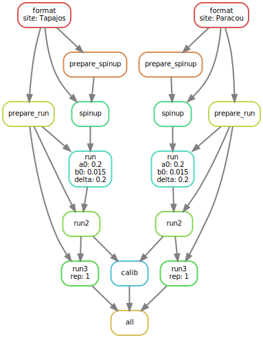

# trollExp - Run a TROLL experiment with phenology

Sylvain Schmitt June 26, 2023

-   [Installation](#installation)
-   [Usage](#usage)
-   [Workflow](#workflow)
    -   [Data](#data)
    -   [Spin-up](#spin-up)
    -   [Run](#run)
-   [Singularity](#singularity)
-   [Data](#data-1)

[`singularity` & `snakemake`](https://github.com/sylvainschmitt/snakemake_singularity) 
workflow to run a TROLL experiment with phenology.

<figure>



<figcaption aria-hidden="true">

Workflow.

</figcaption>

</figure>

# Installation

-   [x] Python ≥3.5
-   [x] Snakemake ≥5.24.1
-   [x] Golang ≥1.15.2
-   [x] Singularity ≥3.7.3
-   [x] This workflow

``` bash
# Python
sudo apt-get install python3.5
# Snakemake
sudo apt install snakemake`
# Golang
export VERSION=1.15.8 OS=linux ARCH=amd64  # change this as you need
wget -O /tmp/go${VERSION}.${OS}-${ARCH}.tar.gz https://dl.google.com/go/go${VERSION}.${OS}-${ARCH}.tar.gz && \
sudo tar -C /usr/local -xzf /tmp/go${VERSION}.${OS}-${ARCH}.tar.gz
echo 'export GOPATH=${HOME}/go' >> ~/.bashrc && \
echo 'export PATH=/usr/local/go/bin:${PATH}:${GOPATH}/bin' >> ~/.bashrc && \
source ~/.bashrc
# Singularity
mkdir -p ${GOPATH}/src/github.com/sylabs && \
  cd ${GOPATH}/src/github.com/sylabs && \
  git clone https://github.com/sylabs/singularity.git && \
  cd singularity
git checkout v3.7.3
cd ${GOPATH}/src/github.com/sylabs/singularity && \
  ./mconfig && \
  cd ./builddir && \
  make && \
  sudo make install
# detect Mutations
git clone git@github.com:sylvainschmitt/trollExp.git
cd trollExp
git checkout pheno-fluxnet
```

# Usage

### Locally

``` bash
snakemake -np -j 1 # dry run
snakemake --dag | dot -Tsvg > dag/dag.svg # dag
snakemake -j 1 --use-singularity --singularity-args # run
```

### HPC

``` bash
module load bioinfo/snakemake-5.25.0 # for test on node
snakemake -np # dry run
sbatch job_genologin.sh # run
```

# Workflow

## Data

### [rename](https://github.com/sylvainschmitt/trollExp/blob/pheno-fluxnet/rules/rename.py)

Rename and copy FLUXNET raw files.

### [format](https://github.com/sylvainschmitt/trollExp/blob/pheno-fluxnet/rules/format.py)

-   Script: [`format.R`](https://github.com/sylvainschmitt/trollExp/blob/pheno-fluxnet/scripts/format.R)

Format FLUXNET raw, species and soil data into TROLL inputs.

## Spin-up

### [prepare_spinup](https://github.com/sylvainschmitt/trollExp/blob/pheno-fluxnet/rules/prepare_spinup.py)

-   Script: [`prepare_spinup.R`](https://github.com/sylvainschmitt/trollExp/blob/pheno-fluxnet/scripts/prepare_spinup.R)

Prepare climate data as a TROLL input for a 600-years spin-up.

### [spinup](https://github.com/sylvainschmitt/trollExp/blob/pheno-fluxnet/rules/spinup.py)

-   Script: [`spinup.R`](https://github.com/sylvainschmitt/trollExp/blob/pheno-fluxnet/scripts/spinup.R)

Run a TROLL simulation for a 600-years spin-up.

## Run

### [prepare_run](https://github.com/sylvainschmitt/trollExp/blob/pheno-fluxnet/rules/prepare_run.py)

-   Script: [`prepare_run.R`](https://github.com/sylvainschmitt/trollExp/blob/pheno-fluxnet/scripts/prepare_run.R)

Prepare climate data as a TROLL for the run.

### [run](https://github.com/sylvainschmitt/trollExp/blob/pheno-fluxnet/rules/run.py)

-   Script: [`run.R`](https://github.com/sylvainschmitt/trollExp/blob/pheno-fluxnet/scripts/run.R)

Run a TROLL simulation.

# Singularity

The whole workflow currently rely on the [`singularity-troll` image](https://github.com/sylvainschmitt/singularity-troll).

# Data

-   [FLUXNET 2015](https://fluxnet.org/data/fluxnet2015-dataset/)
-   [Soil gathered by Isabelle](https://main--altpages.netlify.app/pheno#soils)
-   [Imputed species traits](https://main--altpages.netlify.app/biod-imp)
